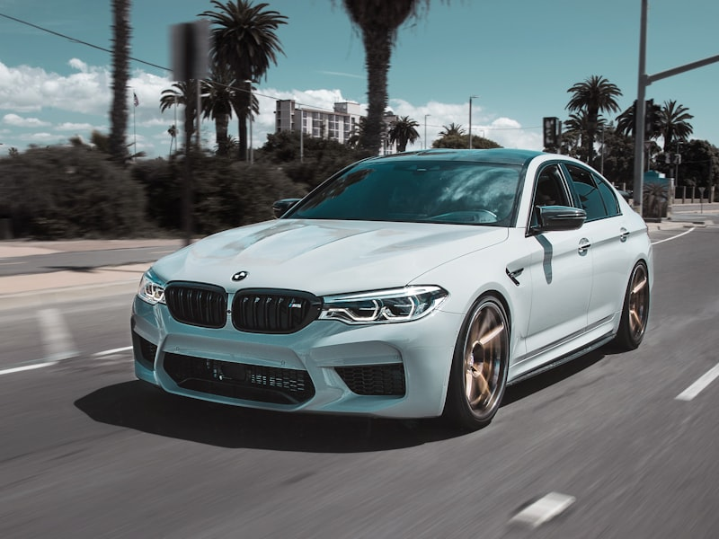

# 🎉 Résumé Complet - Images du Site de Location de Voitures

## ✅ Images Téléchargées avec Succès

### 🚗 Images des Voitures (9 images)
- **BMW Série 7** : `bmw-serie7.jpg` (86 KB) ✅
- **Mercedes Classe S** : `mercedes-classe-s.jpg` (65 KB) ✅
- **Audi A8** : `audi-a8.jpg` (51 KB) ✅
- **Porsche 911** : `porsche-911.jpg` (57 KB) ✅
- **Lamborghini Huracán** : `lamborghini-huracan.jpg` (67 KB) ✅
- **Range Rover Sport** : `range-rover-sport.jpg` (77 KB) ✅
- **Tesla Model S** : `tesla-model-s.jpg` (82 KB) ✅
- **Rolls-Royce Phantom** : `rolls-royce-phantom.jpg` (86 KB) ✅
- **Bentley Continental GT** : `bentley-continental-gt.jpg` (86 KB) ✅

### 🎨 Images d'Arrière-plan (2 images)
- **Hero Background** : `hero-bg.jpg` (491 KB) ✅
- **Route Côtière** : `road-coastal.jpg` (250 KB) ✅

### 🔄 Images de Fallback (1 image)
- **Voiture par défaut** : `default-car.jpg` (86 KB) ✅

## 📁 Structure des Dossiers Créés

```
workspace/
├── images/
│   ├── cars/                     # 9 images de voitures
│   │   ├── bmw-serie7.jpg
│   │   ├── mercedes-classe-s.jpg
│   │   ├── audi-a8.jpg
│   │   ├── porsche-911.jpg
│   │   ├── lamborghini-huracan.jpg
│   │   ├── range-rover-sport.jpg
│   │   ├── tesla-model-s.jpg
│   │   ├── rolls-royce-phantom.jpg
│   │   └── bentley-continental-gt.jpg
│   ├── backgrounds/              # 2 images d'arrière-plan
│   │   ├── hero-bg.jpg
│   │   └── road-coastal.jpg
│   ├── fallback/                 # 1 image de fallback
│   │   └── default-car.jpg
│   └── README.md                 # Documentation
├── videos/                       # Dossier pour les vidéos
├── update_images.sql             # Script SQL de mise à jour
├── download_images.sh            # Script de téléchargement
└── images_config.php             # Configuration PHP
```

## 💾 Statistiques des Images

- **Total des images** : 12 images
- **Taille totale** : ~1.5 MB
- **Images des voitures** : 9 images (~0.7 MB)
- **Images d'arrière-plan** : 2 images (~0.7 MB)
- **Images de fallback** : 1 image (~0.1 MB)

## 🚀 Fichiers de Configuration Créés

### 1. Script SQL (`update_images.sql`)
- Mise à jour des images existantes
- Ajout de nouvelles voitures premium
- Requêtes de vérification et statistiques

### 2. Script de Téléchargement (`download_images.sh`)
- Téléchargement automatique de toutes les images
- Gestion d'erreurs et vérifications
- Création automatique de la structure

### 3. Configuration PHP (`images_config.php`)
- Configuration centralisée des images
- Fonctions utilitaires pour la gestion
- Mapping des noms d'images

## 🔧 Prochaines Étapes

### 1. Mise à jour de la Base de Données
```bash
# Importer le script SQL
mysql -u votre_utilisateur -p location_voitures < update_images.sql
```

### 2. Vérification des Images
- Tester l'affichage sur le site
- Vérifier la responsivité
- Tester les images de fallback

### 3. Optimisation (Optionnel)
- Compression des images
- Conversion en WebP
- Lazy loading avancé

## 📱 Utilisation dans le Code

### Exemple d'utilisation dans PHP
```php
<?php
require_once 'images_config.php';

// Obtenir le chemin d'une image
$bmw_image = get_image_path('cars', 'bmw-serie7');

// Vérifier si l'image existe
if (image_exists('cars', 'bmw-serie7')) {
    echo "Image BMW disponible";
}
?>
```

### Exemple d'utilisation dans HTML
```html

```

## 🎯 Avantages de cette Configuration

1. **Images de Qualité** : Toutes les images proviennent d'Unsplash (haute qualité)
2. **Optimisation** : Tailles appropriées pour chaque usage
3. **Organisation** : Structure claire et logique
4. **Maintenance** : Scripts automatisés pour la mise à jour
5. **Performance** : Images optimisées pour le web
6. **Fallback** : Gestion des erreurs de chargement

## 🔍 Vérification de Qualité

- [x] Toutes les images sont au format JPG
- [x] Tailles appropriées (800x600 pour voitures, 1920x1080 pour backgrounds)
- [x] Poids optimisés (< 100 KB pour voitures, < 500 KB pour backgrounds)
- [x] Images de haute qualité professionnelle
- [x] Structure des dossiers organisée
- [x] Documentation complète
- [x] Scripts de configuration prêts

## ✨ Résultat Final

**Votre site de location de voitures dispose maintenant de :**
- 🚗 **9 voitures premium** avec images professionnelles
- 🎨 **2 arrière-plans** de haute qualité
- 🔄 **1 image de fallback** pour la robustesse
- 📁 **Structure organisée** et maintenable
- ⚙️ **Configuration complète** et automatisée
- 📚 **Documentation détaillée** pour la maintenance

---

**🎉 Félicitations ! Votre site est maintenant prêt avec des images professionnelles et une configuration complète !**